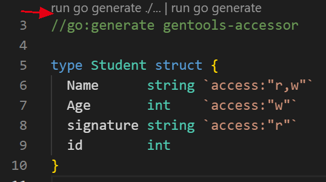
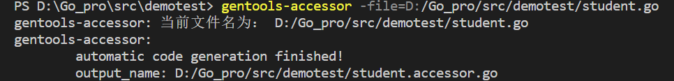
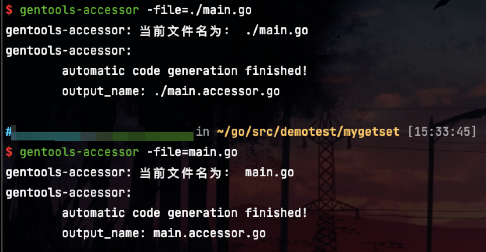

### Description

> 基于GoAST为结构体自动生成Get和Set方法


### 工具安装

```shell
go install github.com/wzomg/gentools-accessor@v0.0.5
```

### 用法示例

法1：将`//go:generate gentools-accessor`写入待解析的文件中，用goland或vscode提供的标志执行即可。

提供了tag标识：`access`，对应tag-value只识别`r`（Getter）、`w`（Setter）。不写这个tag，解析语法树时都带上，默认都解析。

```go
package main

//go:generate gentools-accessor -mode=1
// -mode=1 => 参数可选

type Student struct {
	Name      string `access:"r,w"`
	Age       int    `access:"w"`
	signature string `access:"r"`
	id        int
}
```
注意：

若不加tag：`access`，默认提供Getter和Setter方法，且对应的方法名为如`GetId`，即字段首字母小写变为大写。

若struct里有两个字段名几乎一模一样，仅仅因字符大小写的区别就生成不了代码，报错字段并提醒修正。

若只需要一键生成所有字段的Getter方法，需要增加`-mode=1`这个参数

若只需要一键生成所有字段的Setter方法，需要增加`-mode=2`这个参数

最最重要的一点：生成的代码已经默认格式化和导包，不用额外处理，直接拿来用即可！



法2：命令行执行：`gentools-accessor -file=文件名 -mode=0|1|2`（支持相对路径和绝对路径）

`-file`：表示文件名参数，其必须被设置。

`-mode`：参数值范围为`[0, 2]`，0：提供Getter和Setter方法；1：只提供Getter方法；2：只提供Setter方法。




